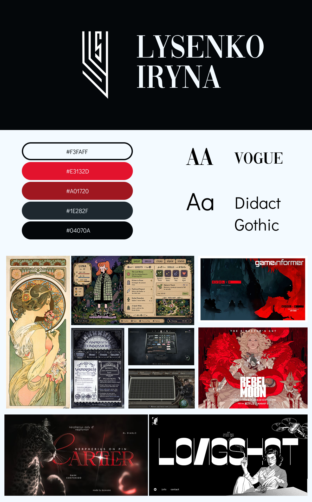
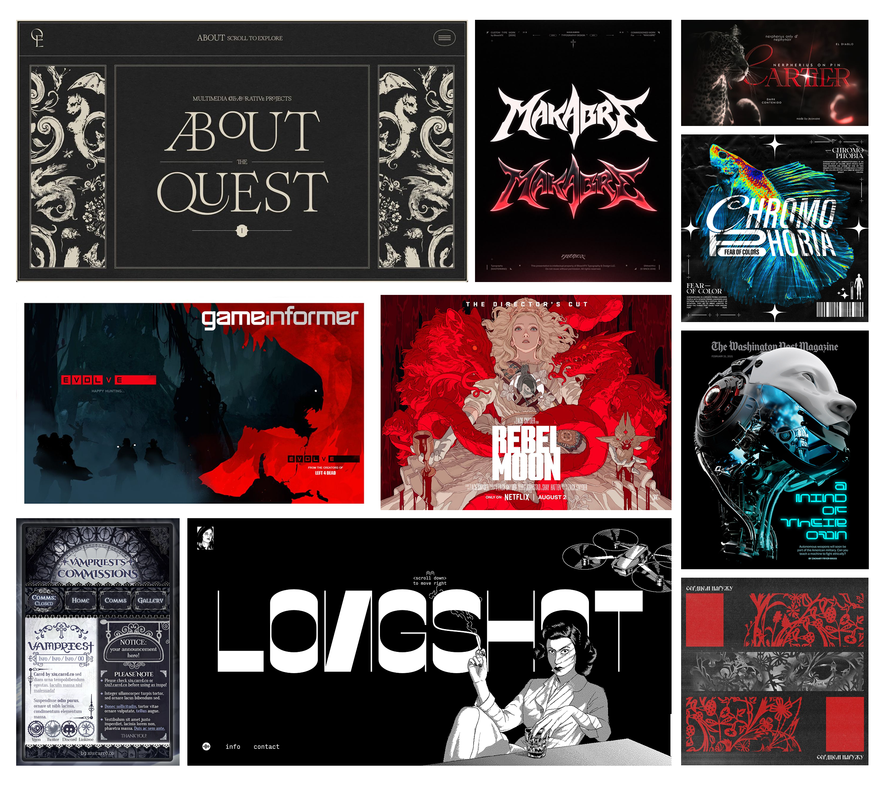

# portfolio-iryna-lysenko

***Esthétique***

***1.Quel type de poste ou de stage je vise en sortant du programme?*** 
Caméraman, concept artist, game dev, design graphique, animatrice 2D/3D 
***2.Qui va probablement regarder mon portfolio? (un•e recruteur•e d'agence, une petite entreprise, un•e client•e potentiel•le...)*** 
Un•e recruteur•e d'agence des grandes companies, les clients potentiels, mes parents 
***3.Qu'est-ce que cette personne cherche à voir en premier?*** 
Qui je suis (nom, prénom) et ce que je fais. Quelque chose punchy, directe, and enthusiaste 
***4.Quel style visuel (couleurs, typographie, ambiance générale) représenterait le mieux l'identité professionnelle que je veux projeter?*** 
Couleurs : monochrome noir et blanc avec un couleur accent; Typo : Gras, sérif- sérieux, gothique, professionnel, style; Ambiance : Directe (straight to the point), artistique, gothique, nerd et original. Styles d’inspiration : Gothique, Cyberpunk, Art Nouveau (Alphonse Mucha), style de Devil May Cry. Contraste d’esthétique sombre et sérieuse avec quelque chose de soft et en peu féminin et cute. Bento-box layout. 
***5.Quelle impression je veux que cette personne retienne après avoir visité mon site?*** 
Je veux que l’utilisateur se dit : « Holy shit.. », soit impressionné et va se souvenir de moi. Je veux qu’elle pense à moi quand ils ont besoin de quelqu’un déterminé, enthousiaste et stylisé pour leur projet. Je veux également mettre l’accent sur ma créativité et mon côté artistique. 

P.s. : Une idée que je pensais c’est de faire une interface comme un mini jeu vidéo, bue que je considère travailler dans game-dev, comme si je suis un personnage d’un jeu. L’interface va présenter moi en gif 2D ou peut-être une modèle 3D, ainsi que mes capacités en style des skills des personnages. 

**Les autres idées :**
-	glow text/boder on hover
-	Potentiellement l’arrière-plan coloré (rouge ou transition des couleurs)
-	Put a half-transparent black overlay and put less overlay and zoom on a hover
-	Utiliser l’image de couteau swiss pour représenter la polyvalence
-	Les logiciels dans inventaire en style de Resident Evil 4

**Sites inspirants:**
- [Diabolik](https://www.diabolik.net/)
- [Longshot Features](https://longshotfeatures.com/)
- [Vovi Studio](https://www.vovi.studio/)
- [BleachFX(Brazilian)](https://bleachfx.com/home) 

**Projets potentiels à mettre :**
- Beauté fatale / OnyxIA
- Glowfall
- L’ascention/ Pixar Pistache
- TP1 Août/Mars
